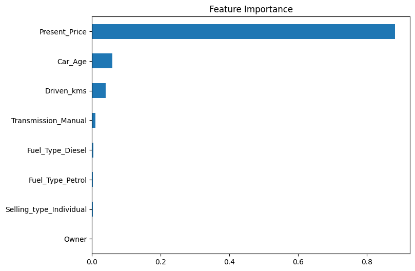

# 🚗 Car Price Prediction with Machine Learning

This project was developed as part of the **CodeAlpha Data Science Internship**, focused on using regression models to predict the selling price of a used car based on its features.

---

## 🎯 Task Objectives

✔️ Collect car-related features like brand, price, mileage, etc.  
✔️ Train a **regression model** to predict car selling prices  
✔️ Apply data preprocessing and feature engineering techniques  
✔️ Use libraries like **Pandas**, **Scikit-learn**, and **Matplotlib**  
✔️ Evaluate model performance using R², MAE, and MSE  

---

## 📘 Dataset Overview

The dataset contains the following features:

- `Car_Name`: Name of the car model  
- `Year`: Manufacturing year  
- `Selling_Price`: Target variable (car's resale price)  
- `Present_Price`: Original showroom price  
- `Driven_kms`: Total kilometers driven  
- `Fuel_Type`: Fuel type (Petrol, Diesel, etc.)  
- `Selling_type`: Sale channel (Dealer/Individual)  
- `Transmission`: Manual or Automatic  
- `Owner`: Number of previous owners  

Database Link: https://www.kaggle.com/datasets/vijayaadithyanvg/car-price-predictionused-cars

---

## 🚀 Project Workflow

1. Load and explore the dataset  
2. Create derived features (e.g., `Car_Age` from `Year`)  
3. Handle categorical variables using one-hot encoding  
4. Split data into training and test sets  
5. Train a **Random Forest Regressor**  
6. Evaluate model performance using standard metrics  
7. Visualize feature importances

---

## 📊 Exploratory Data Analysis

### 🔍 Feature Importance

The most important feature influencing the car's price is `Present_Price`, followed by `Car_Age` and `Driven_kms`. Other features had relatively low importance.

  

---

## 🧪 Model Performance

- **Model Used**: Random Forest Regressor  
- **Evaluation Metrics**:
  - R² Score: (printed in notebook)
  - MAE: (printed in notebook)
  - MSE: (printed in notebook)

---
